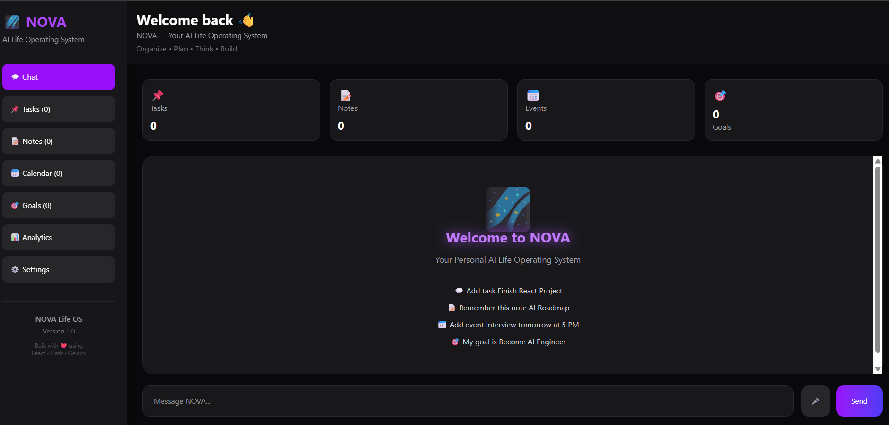
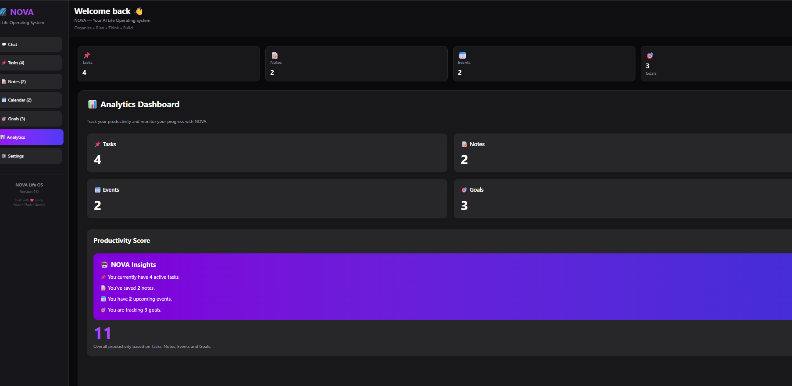
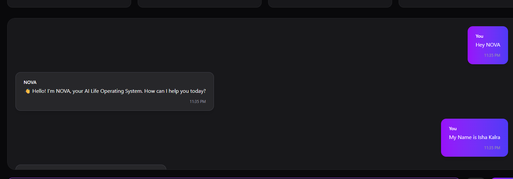
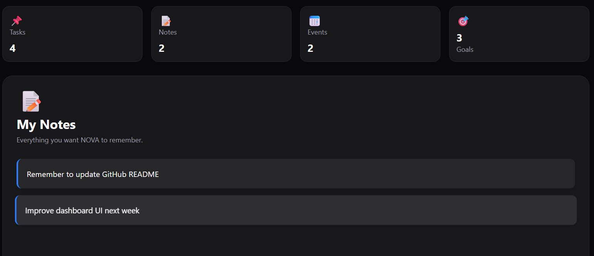
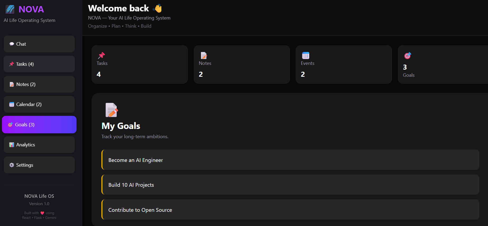
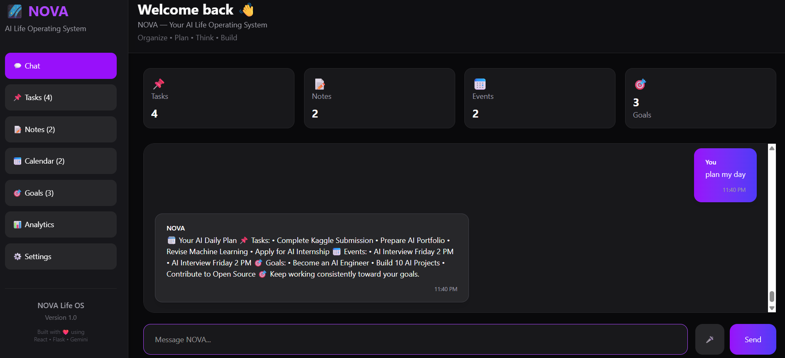
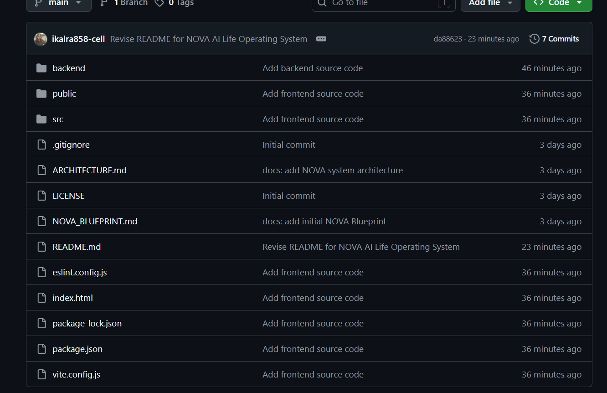

# 🚀 NOVA – AI Life Operating System

> An AI-powered productivity assistant built with **React**, **Flask**, **SQLite**, and **Google Gemini 2.5 Flash**.

NOVA helps users manage their daily life through natural language conversations. It combines AI chat with productivity tools including tasks, notes, events, goals, memory, and daily planning—all in one place.

---

## 🔗 Quick Links

- 📂 **GitHub Repository:** https://github.com/ikalra858-cell/nova-lifeos
- 🎥 **Demo Video:** [https://youtu.be/YOUR_VIDEO_ID](https://youtu.be/PPsTq0nvC8Q?si=-g2K8toQArhOizL6)

---

# ✨ Features

- 🤖 AI Chat powered by Google Gemini
- ✅ Task Management
- 📝 Notes Management
- 📅 Event Scheduling
- 🎯 Goal Tracking
- 🧠 Personal & Generic Memory
- 🗓 AI Daily Planner
- 🎤 Voice Commands
- 📊 Productivity Dashboard
- 💾 Persistent SQLite Storage

---

# 🛠 Tech Stack

### Frontend
- React
- Tailwind CSS
- Axios
- Vite

### Backend
- Flask
- Python
- SQLite
- Google Gemini API

---

# 📂 Project Structure

```text
nova-lifeos/
│
├── backend/
├── public/
├── src/
├── screenshots/
├── README.md
├── ARCHITECTURE.md
├── NOVA_BLUEPRINT.md
└── package.json
```

---

# ⚙️ Installation

## 1. Clone the Repository

```bash
git clone https://github.com/ikalra858-cell/nova-lifeos.git
cd nova-lifeos
```

## 2. Backend Setup

Navigate to the backend folder:

```bash
cd backend
```

Install the required Python packages:

```bash
pip install -r requirements.txt
```

Create a `.env` file inside the **backend** folder and add your Google Gemini API key:

```env
GEMINI_API_KEY=YOUR_GOOGLE_GEMINI_API_KEY
```

Start the Flask backend server:

```bash
python app.py
```

The backend will run at:

```
http://127.0.0.1:5000
```

---

## 3. Frontend Setup

Open a new terminal and navigate to the project root, then start the frontend:

```bash
cd nova-lifeos
npm install
npm run dev
```

The frontend will run at:

```
http://localhost:5173
```

Open the above URL in your browser to use NOVA.

---

# 📸 Screenshots

## Dashboard



---

## Analytics



---

## AI Chat



---

## Tasks


---

## Notes



---

## Goals



---

## AI Planner



---

## GitHub Repository



---

# 🎥 Demo Video

Watch NOVA in action on YouTube:

▶️ [https://youtu.be/abcdefgh123](https://youtu.be/PPsTq0nvC8Q?si=-g2K8toQArhOizL6)

---

# 🎯 Future Improvements

- Multi-agent architecture
- Google Calendar integration
- Cloud synchronization
- User authentication
- Mobile application
- Smart reminders
- Weekly AI planning

---

# 📄 License

This project is licensed under the MIT License.

---

## 👩‍💻 Author

**Isha Kalra**

Built for the **Kaggle AI Agents: Intensive Vibe Coding Capstone Project (2026)**.

---

## 🙏 Acknowledgements

This project was built as part of the Kaggle **AI Agents: Intensive Vibe Coding Capstone Project** and uses **Google Gemini** for conversational AI capabilities.
